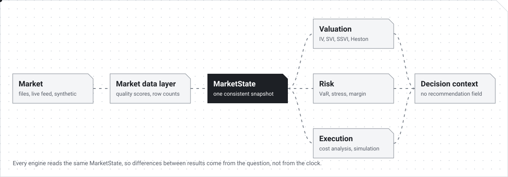

<p align="center">
  
</p>

An open-source analytics platform for options traders, independent quants and
small trading teams who do not have an institution's risk and cost-analysis
systems. It answers one question in three parts:

> What is this position approximately worth, what risk does it add, and what
> will it probably cost to execute?

It is a research tool. It never outputs a buy or sell signal, a "fair value" or
a broker's margin figure. Every number comes with the data it was computed
from, the model that produced it, and what the platform could not do.

**Contents:** [Features](#features) · [System requirements](#system-requirements) ·
[Install and run](#install-and-run) · [How to use it](#how-to-use-it) ·
[Commands](#commands) · [Project layout](#project-layout) ·
[Documentation](#documentation)

---

## How it fits together

<p align="center">
  
</p>

## Features

### Market data

- **Upload an option chain as the exchange exported it.** The layout, delimiter,
  header row and date order are detected, and the reading is shown to you
  before anything is stored. Two-sided NSE chain downloads, the NSE bhavcopy,
  and ordinary one-row-per-quote files are all read.
- **Nothing is dropped without a reason.** Rows in always equal rows kept plus
  excluded plus rejected, and each excluded or rejected row says why.
- **A file that cannot be read is refused**, not stored as a near-empty
  snapshot.
- **Data-quality scores** on every quote: freshness, spread, liquidity,
  consistency and completeness.
- **Live market data** through a broker connection, a **historical warehouse**
  in partitioned Parquet, and a **synthetic market** so you can try everything
  with no data of your own.

### Valuation

- Black-76 and Black-Scholes-Merton with analytic Greeks.
- An implied-volatility solver that also reports how well each volatility is
  pinned down by its price.
- Forward estimation three ways: spot and carry, futures, and put-call parity.
- Volatility surfaces: SVI per expiry and SSVI across expiries, with the
  no-arbitrage conditions enforced during the fit.
- Dupire local volatility, Heston, and a model consensus that reports the range
  the models span rather than picking one.
- A surface-deviation scanner that measures how far a quote sits from the fitted
  surface and what could explain it.

### Portfolio and risk

- Portfolios valued against one market snapshot, with Greeks grouped by
  underlying, expiry, asset class, strategy tag and currency.
- Value at Risk and Expected Shortfall by three methods, two of which fully
  reprice the book.
- Scenario stress tests by full repricing.
- Estimated margin under a named model, with the estimated shortfall region
  instead of a liquidation price.
- Portfolio construction: optimisers, Black-Litterman and CVaR.

### Execution and research

- Transaction cost analysis on your own trade log, against six benchmarks.
- Simulation of TWAP, VWAP, POV and liquidity-adaptive schedules, always
  labelled as counterfactual estimates.
- Order-book analytics, gated on what the data can actually support.
- Unified order analysis: one proposed order run through every engine from the
  same snapshot.
- Backtesting with point-in-time features, and paper trading through the same
  order path live trading uses.

### The web app

- Grey-and-white interface with display settings for text size, contrast and a
  dark-grey background.
- Full keyboard use: `Ctrl K` jumps to any page, and every table scrolls from
  the keyboard.

What each phase shipped, and what was left out on purpose, is in
[`docs/project-status.md`](docs/project-status.md).

---

## System requirements

You can run the platform two ways. The local way needs very little.

| | Local (one machine, no services) | Full stack (Docker) |
| --- | --- | --- |
| **Use it for** | Trying it, development, tests | Multi-user or long-running use |
| **Operating system** | Linux, macOS, or Windows with WSL 2 | Anything that runs Docker |
| **Python** | 3.12 or newer | Not needed on the host |
| **Node.js** | 18.17 or newer, for the web app (22 is what the Docker image uses) | Not needed on the host |
| **Docker** | Not needed | Docker Engine with Compose v2 |
| **Database** | SQLite, created for you | PostgreSQL 16 (TimescaleDB image) |
| **Queue and cache** | None: jobs run inline | Redis 7 and a Celery worker |
| **File storage** | A local folder | MinIO (S3-compatible) |
| **Free ports** | 8000 (API), 3000 (web) | 80, 3000, 8000, 9001 |

Other things to know:

- `make` and a POSIX shell are used for the commands below.
- No GPU is needed. The numerics run on NumPy and SciPy.
- The web app loads its fonts from Google Fonts. Offline, it falls back to
  system fonts and works the same.
- Development so far has been on Linux. macOS and WSL 2 should behave the same
  but are not part of the test runs.
- The full test suite takes about 18 minutes on a laptop.

---

## Install and run

### Option 1: local, no Docker

```bash
git clone https://github.com/sanketwork300-hash/Quantx.git
cd Quantx

make venv        # create .venv and install the Python packages
make migrate     # create the SQLite database in ./var
make run         # API on http://localhost:8000
```

In a second terminal, start the web app:

```bash
make web-install # first time only
make web-dev     # web app on http://localhost:3000
```

Jobs run inline in this mode, through the same code path a worker uses, so
upload, ingestion and analysis all work with no other services.

### Option 2: full stack with Docker

```bash
cp .env.example .env

# Generate the two secrets and paste them into .env
python -c "import secrets; print(secrets.token_hex(32))"   # QIP_SECRET_KEY
python scripts/generate_credential_key.py                  # QIP_CREDENTIAL_ENCRYPTION_KEYS

make up          # build and start everything
make logs        # follow the API and worker logs
make down        # stop
```

| Address | What is there |
| --- | --- |
| <http://localhost:3000> | Web app |
| <http://localhost:8000/docs> | API and interactive docs |
| <http://localhost> | Everything, through the proxy |
| <http://localhost:9001> | MinIO console |

---

## How to use it

<p align="center">
  
</p>

You do not need market data to start. The repository ships a synthetic,
arbitrage-free option chain in `tests/data/`.

1. **Create an account.** Open <http://localhost:3000/login>, enter an email and
   password, and register.

2. **Import an option chain.** Go to **Imports** and upload
   `tests/data/options_chain_clean.csv`. The page shows which column each field
   was read from and the first rows as they were read. Set the as-of time to
   before the chain's expiry, then choose **Ingest**.

   Try `options_chain_bad_quotes.csv` afterwards to see rejected and excluded
   rows listed with their reasons.

3. **Look at the chain.** Open **Option chains** and pick the snapshot. Every
   quote has its quality scores, and every exclusion has its reason.

4. **Solve implied volatility, then fit a surface.** From the chain, follow
   **Implied volatility**, then fit a volatility surface, then scan for
   deviations. On the clean chain the scanner finds nothing, which is correct.
   Change one quote in the CSV, import it again, and the scanner finds it.

5. **Build a portfolio.** Go to **Portfolios**, create one, and import
   `tests/data/portfolio_options.csv`. Value it, then open **Risk and stress**
   to apply a scenario and **Margin** to see the estimated requirement and
   shortfall region.

6. **Analyse your trades.** Go to **Trade analysis** and upload
   `tests/data/trades.csv` to benchmark executions. **Simulation** prices
   TWAP and VWAP schedules against the same price path.

To use your own files, upload a chain exactly as your exchange or broker
exported it. If a date column could be read day-first or month-first and
nothing in the file settles it, the page asks you to choose rather than
guessing.

To connect a live feed, go to **Broker connections**. Credentials are granted
through the broker's own sign-in and stored encrypted; they are never typed
into a settings file. See [`docs/credentials.md`](docs/credentials.md).

### Make the interface easier to read

Open **Display settings** at the bottom of the sidebar to change text size,
switch to high contrast, or use the dark-grey background. The choice is
remembered in your browser. Press `Ctrl K` (`⌘ K` on a Mac) anywhere to jump to
a page by typing part of its name.

---

## Commands

```bash
make help              # list every command
make test              # unit, integration, quant validation and regression tests
make test-quant        # numerical correctness only, no database needed
make check             # lint, layering rules and tests: everything CI runs
make fix               # apply lint fixes and formatting
make fixtures          # regenerate the synthetic test data
make golden-diff       # report drift against the stored reference results
make stream            # run the live market-data feed worker
make web-build         # production build of the web app
```

---

## Project layout

```
apps/            process entry points: API, worker, scheduler, stream
api/             HTTP routes, request and response schemas, authorisation
domains/         instruments, market data, derivatives, portfolio, risk,
                 scenarios, execution, microstructure, research, warehouse
quant/           pure numerics: pricing, volatility, statistics, simulation
infrastructure/  database, cache, queue, object storage, security, logging
web/             Next.js web app
tests/           unit, integration, quant validation, regression, performance
migrations/      database migrations (Alembic)
docs/            architecture, methodology, API contract and design notes
scripts/         layering check, fixture and reference-result generation
```

Dependencies point one way and a script enforces it:
`apps → api → domains → quant`, with `infrastructure` beside `quant`. The
`quant` package imports nothing else from this repository, which is why its
tests run with no database.

---

## Documentation

| Document | What it covers |
| --- | --- |
| [`docs/project-status.md`](docs/project-status.md) | What each phase shipped, and the ideas the design rests on |
| [`docs/architecture.md`](docs/architecture.md) | System design, module graph, failure handling, security |
| [`docs/methodology.md`](docs/methodology.md) | Formulas, conventions, assumptions and limitations |
| [`docs/api.md`](docs/api.md) | The API contract |
| [`docs/market-data.md`](docs/market-data.md) | Providers, schemas and the quality engine |
| [`docs/live-market-data.md`](docs/live-market-data.md) | Live feed and instrument master |
| [`docs/warehouse.md`](docs/warehouse.md) | Historical data warehouse |
| [`docs/research.md`](docs/research.md) | Features, strategies and backtesting |
| [`docs/trading.md`](docs/trading.md) | Paper and live trading |
| [`docs/deployment.md`](docs/deployment.md) | Docker Compose, migrations, hardening checklist |
| [`docs/testing.md`](docs/testing.md) | Test strategy, tolerances and reference results |
| [`docs/references.md`](docs/references.md) | Literature, and how each algorithm was sourced |

Domain designs: [volatility](docs/volatility.md), [pricing](docs/pricing.md),
[arbitrage](docs/arbitrage.md), [portfolio](docs/portfolio.md),
[risk](docs/risk.md), [margin](docs/margin.md), [execution](docs/execution.md),
[instruments](docs/instruments.md), [database](docs/database.md).

---

## Disclaimer

This software produces model estimates. Model estimates are wrong in ways that
depend on their assumptions, and the platform's job is to make those
assumptions visible. Nothing here is investment advice, a broker margin
calculation, or a guarantee of execution outcomes. Validate everything against
your own data before relying on it.

## Licence

Apache-2.0.
